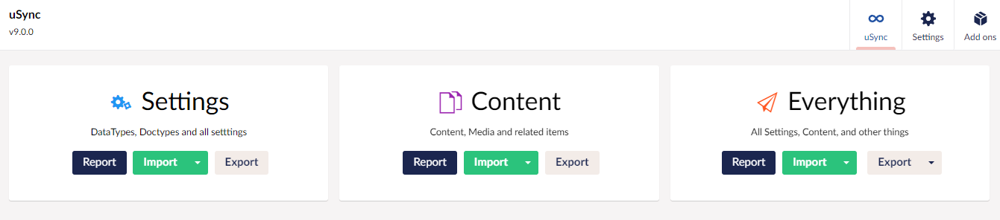
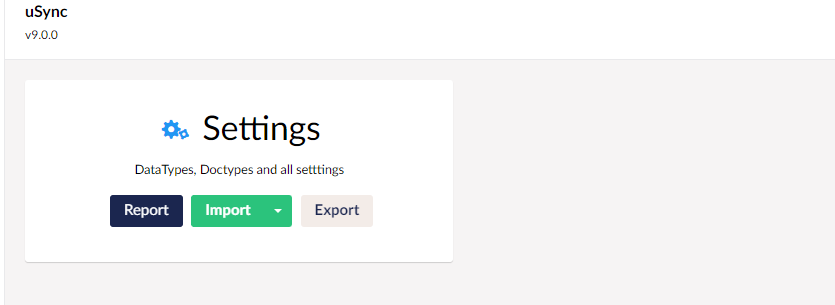

Starting with Umbraco v9, Content edition is enabled by default. This means all changes to content and media will be saved to disk, in the uSync folder.

## Disable Content Saving to Disk. 
if you want to stop uSync from saving content to disk you can turn this off, by telling uSync to only Save Settings on Save:

```json title="appsettings.json"
{
    "uSync" : {
        "Settings": {
            "ExportOnSave" : "Settings" 
        }
    }
}
```

## Disable Content in the UI
Turning off content with the ExportOnSave setting will stop content being saved to disk, but you can still use the UI to import and export content. 



To remove content edition from the UI you can change the `UiEnabledGroups` setting.

```json title="appsettings.json"
{
    "uSync" : {
        "Settings": {
            "UIEnabledGroups": "Settings",
        }
    }
}
```

This will remove the content box from the UI. 

