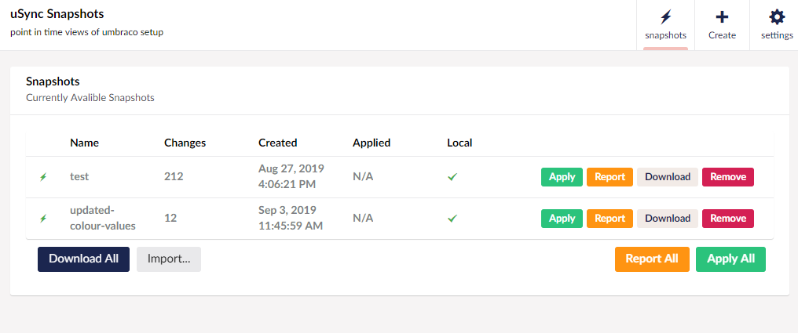

uSync.Snapshots provides you with the ability you take point-in-time snapshots of your Umbraco installation. This means you can track what has changed based on your timescales and feature development. 



## Snapshots Config

Snapshots config allows you to change some basic settings of Snapshots by updating the `appsettings.json` file.  

```json title="/appsettings.json"
{
  "uSync": {
    "DefaultFolders": "~/views,~/wwwroot/css,~/wwwroot/scripts",
    "DisableImport": false,
    "HandlerSet": "Default",
  }
}
```

Setting | Default | Note
--------|---------|--------
DisableImport | False | Will stop all reports/importing of snapshots on this server.
DefaultFolders | "views,css,scripts" | List of folders to include when creating a sync pack. Unlike Export, these values are not additional to the default but will replace them completely.
HandlerSet | Default | Default used handler set.