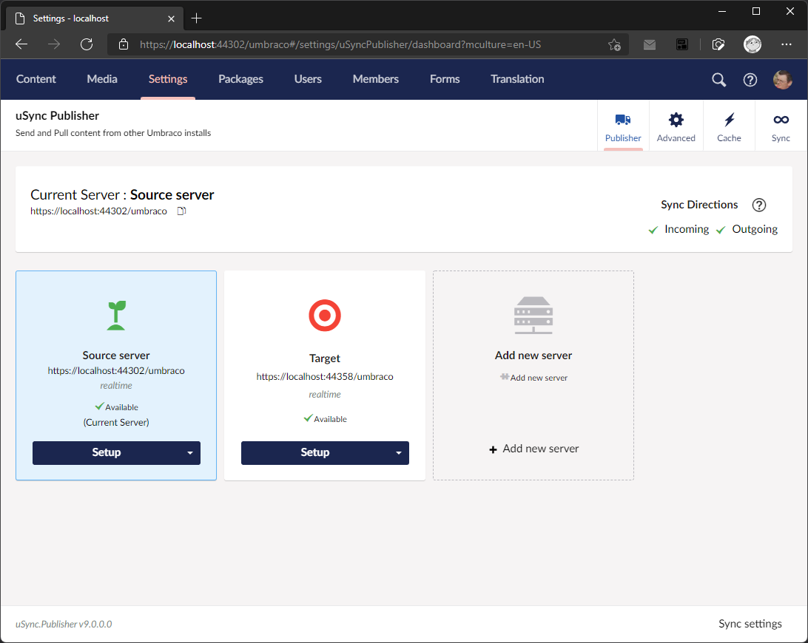
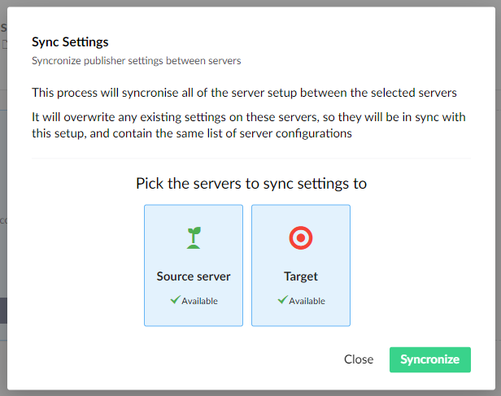

# uSync.Publisher Server Config

For uSync v9, the Server config is stored in the database for each site. The settings can be controlled via the uSync Publisher dashboard on any server.

The settings can be synchronized between servers by using the "Sync settings" option at the bottom of the dashboard, this will then allow you to push your server settings between servers. 

