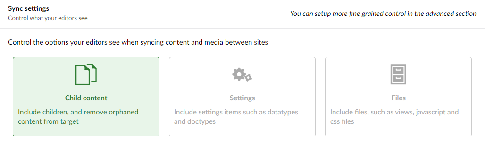
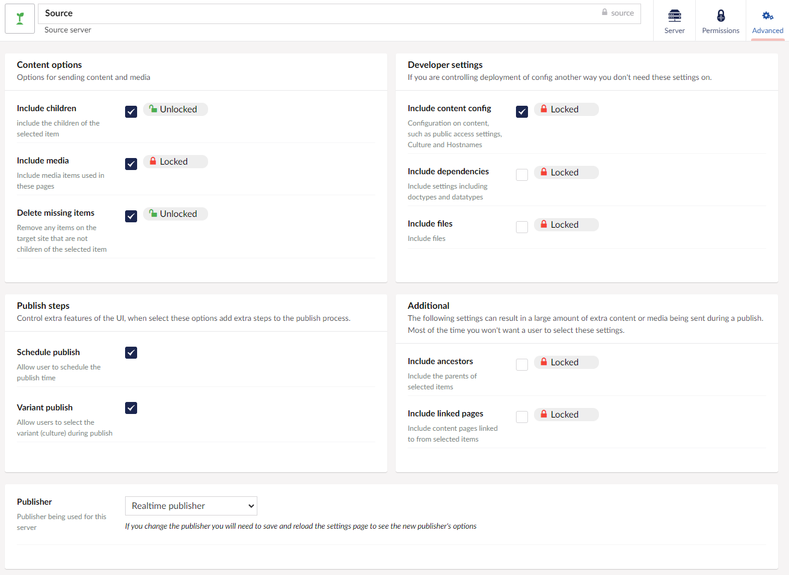

--- 
title: Sync Settings
---

When you configure a server you will see options around how you configure what is sent between servers. 

## Basic options 

These three boxes allow you turn on or off the three major elements of any sync between servers :

Option | note 
-- | -- 
Child content | Adds the "Include children" and "Delete missing items" options, will also sync media if required.
Settings | Allows your editors to also sync required settings such as Doctype, Datatypes and MediaTypes when syncing content or media.
Files | Will include files such as views, css and script files as part of the syncing process.

## Advanced
If you want more granular control over what your editors can and cannot sync, you can control this in the 'Advanced' settings section for your server:

Each advanced option can be on or off and locked or unlocked. 

A locked option will not display to the editor when they are syncing an unlocked option is one the edior can turn on or off during the sync process.

### Content Options 

Option | Note 
-- | --
Include Children | Include the children of the selected item in the sync (e.g all the child pages).
Include Media |  Include any media that is used within the content either in a media picker or directly within a text editor.
Delete missing items | Remove any items from the target site that are not on the source site. This way if a child page is on the target but not the source it will be removed from the source as part of the sync.

### Developer settings

Option | Note 
-- | --
Include content config | Include items such as "Culture and Hostname" and "Public access settings" in general if you do not let your editors change these settings they do not need to be included.
Include dependencies | Include any settings items that are required for the syncing items, eg. the doctypes and datatypes needed for a page of content. 
include files | Include the actual files for any required views/css/scripts.

### Publish Settings

Option | Note 
-- | -- 
Schedule publish | allow the editor to select the scheduled publish time for items. Items will still be synced now, but the items on the target server will have the selected time set as their publish time.
Variant publish | for content that varies by culture. This will allow the editors to select what languages to publish.

### Additional

*These settings are almost never needed and can result it large amounts of content and media being synced when a single item has been selected.*

Option | Note 
-- | --
Include Ancestors | Include the parents of any items.
Include Linked pages |  Include any pages that are linked to from the selected pages. For example, if you publish a page that links to your contact us page, this would also sync the contact us page as part of the process. 

