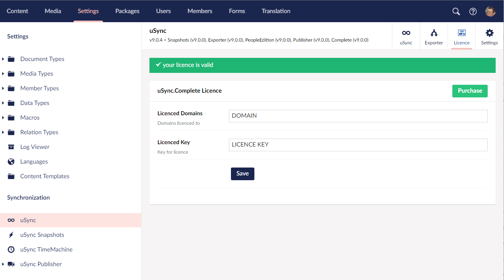

You can purchase a licence for uSync.Complete from our website 

https://jumoo.co.uk/usync/buy/

You can add the License information via the uSync dashboard by going to the licence tab in Settings -> uSync --> Licence.




Currently licence information is read from the licence file in the /umbraco/Licenses file.

However, if it is more convenient you can store your licence information in the appsettings.json config file.


```json title=appsettings.json
"uSync" : {
  "Complete": {
      "License": {
        "Key": "LICENSE-KEY",
        "Domains": "LICENSE-DOMAIN"
      }
  }
}
```

When reading the licence information, we will first look in the config.

If these values are present in the appsettings.json file it will not attempt to load them from the licence file.

:::note
If the values are in the config, clicking *Save* in the UI will not save any information back to disk.
This way the values can be stored in any of the configuration sources configured for a site (e.g appsettings.json, environmental variables, azure key vault etc).
:::