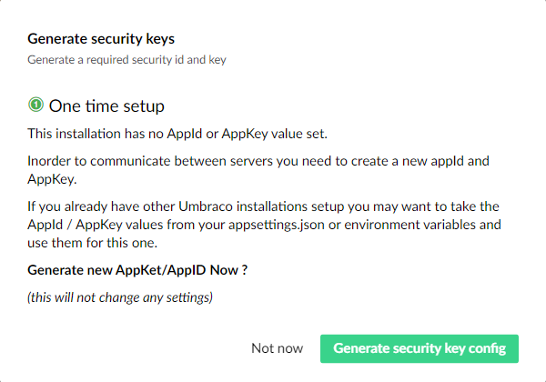
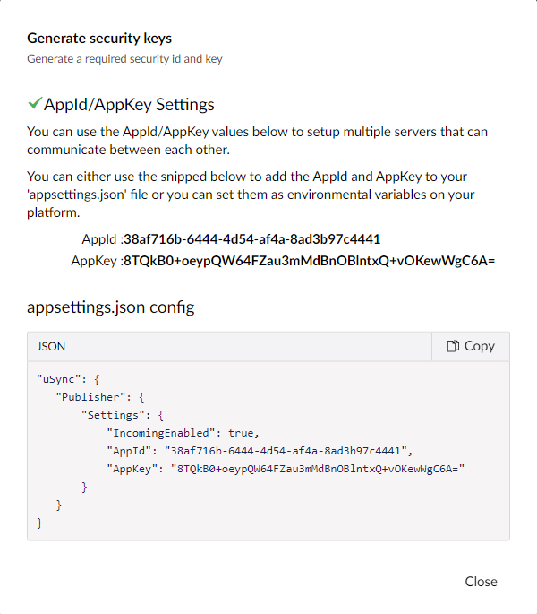

When you first install uSync.Publisher there will be no AppId/AppKey in your setup.

When you visit the dashboard, uSync.Publisher will detect this and prompt you to create a new AppId/AppKey for your config file: 



If you select "Generate security key config" uSync publisher will display the config you need to know. Add it to your `appsettings.json` file.



You should add this config to the end of your appsettings file after the Umbraco settings section. It should **not** be part of the Umbraco settings section.

e.g :

```json title="appsettings.json"
     .... other settings 
  },
  "Umbraco": {
    "CMS": {
      "Hosting": {
        "Debug": false
      },
      "Global": {
        "Id": "bc22002a-9c91-43f4-9232-03d3d3f3430f"
      }
    }
  },
  "uSync": {
    "Publisher": {
      "Settings": {
        "IncomingEnabled": true,
        "AppId": "38af716b-6444-4d54-af4a-8ad3b97c4441",
        "AppKey": "8TQkB0+oeypQW64FZau3mMdBnOBlntxQ+vOKewWgC6A="
      }
    }
  }
}
```

You will need to have the AppId and AppKey settings in the config for all of the Umbraco instances you want to synchronize with uSync.Publisher.


:::caution 
Do not just copy the AppKey/AppId from this documentation. Use the values generated by uSync.Publisher from the "Generate Security key config" dialog box to ensure your keys are unique for your setup.
:::