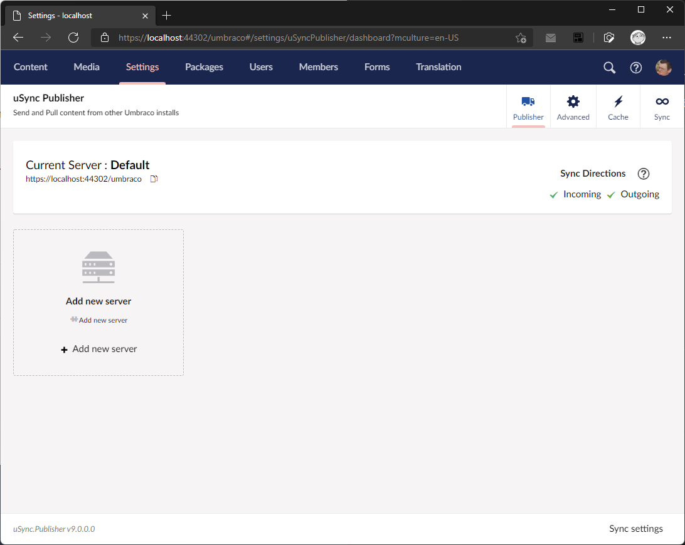
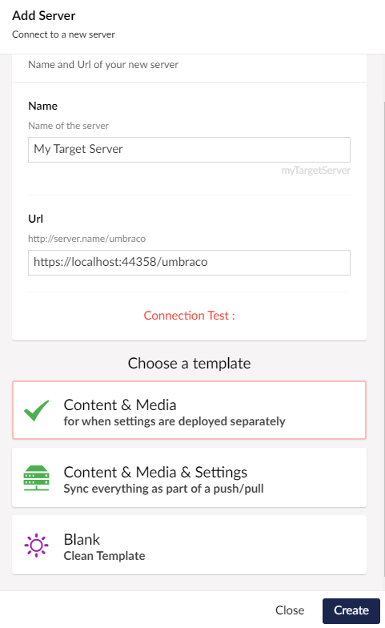

Once you have setup secure keys for your servers you will need to add them to the uSync.Publisher dashboard. 

1. Go to the uSync Publisher dashboard and click on "Add Server".

2. In the Add Server dialog enter the name and URL of the server you want to connect to and click "Check Connection".

:::note
You can get the url required for a server by going to the uSync.Publisher dashboard for that server and clicking on the URL below the name of the server in the title box.
:::

3. Once the connection has been checked you can select whatever you want to sync between servers. 

If you are going to sync settings separately from content you should select "Content & Media". This will setup uSync.Publisher to sync content and media items when an editor chooses to push/pull items, but not DataTypes, Doctypes and other settings, which can either then be synced via the dashboard in Umbraco or your own CI/CD deployment processes.

:::tip
Its a good idea to the add server you are on to the list of servers. This way you can configure how it works and interacts with the other servers in your setup, and when you sync server settings it will appear on the other servers.
:::