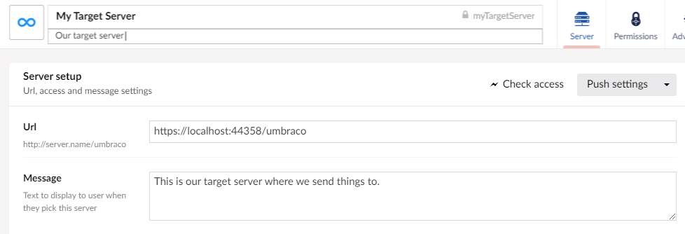
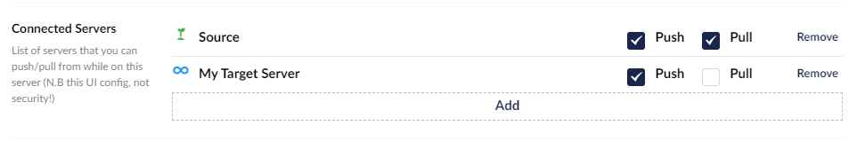

Once you have added a server you can make additional changes (such as picking a new icon, or adding a description to your server) so your editors can easily distinguish between them.

## Setup Connected servers
The most important thing to configure for a new server are the "Connected Servers".

The connected server list determines what actions an editor can or cannot do when they are viewing the website from the server. 

For example in the image above the connected server setup means that when an editor is on the given server they will be able to push and pull content to and from the 'source' server and only push content to 'My Target Server'. 

It is important that these settings are present for a server, or your users will not see the push/pull items in the menu when they right click on content or media. 