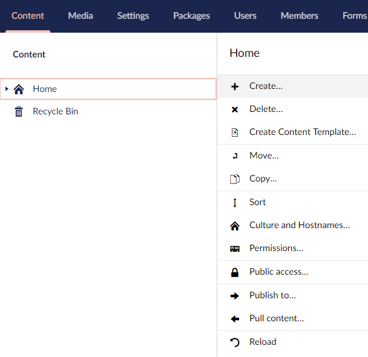
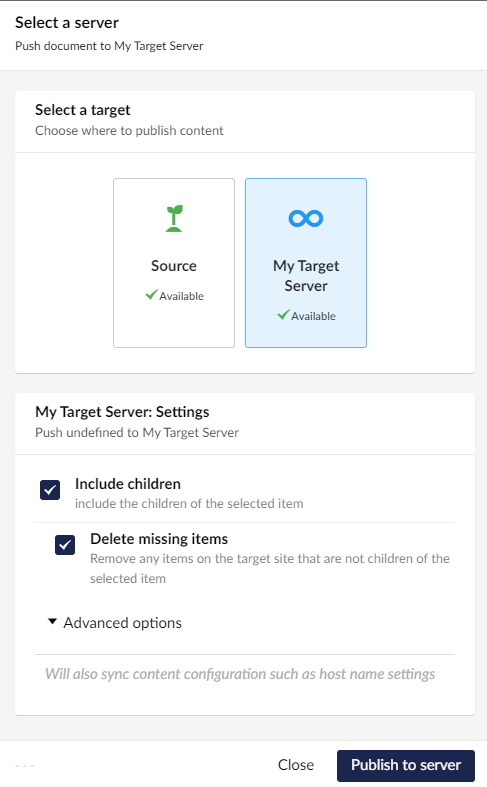
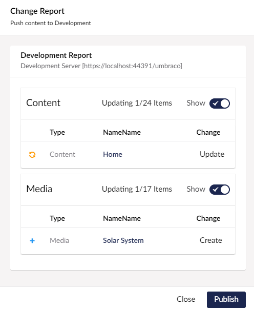

Once you have configured your servers, you are ready to push and pull content between them. 

:::note
If you haven't synced settings between servers via your build process or uSync, you can first sync settings via the push settings option on the server configuration page.
:::

## Push Content 
1. Go to your content tree.
2. Right click on your home content node and select 'Publish to...'.

3. You should now get a dialog that lets you pick which server to push content to, and a few choices about how to push the content.

The basic options available are: 

Option | note 
-- | --
Include Children | Will include all child items beneath the selected pack (so the whole site if you selected the homepage).
Delete missing items | Will remove any pages from the target site that are not in the tree for this site. 

Depending on your setup you might see some advanced options, such as "Include Media", or "Schedule Publish". These settings are described more in our server config section.

## Review Changes

4. If you click "Publish to server" uSync will gather all the information and send it over to the target server. The target server will then respond with a list of potential changes which you can review.

## Push Changes

5. If you are happy with the changes that are going to be made you can choose to continue and uSync will instruct the target server to make the changes. When it is complete it will return another list of the changes made.

## Finish
6. At this point your target server should now have the changes from your source system and everything should be in sync 🎉.