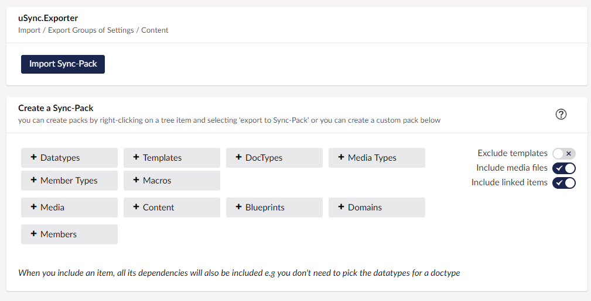

uSync.Exporter provides a dashboard and context menu items that let you build your own 'SyncPack' exports. It contains just the elements you need, in order to move items between Umbraco instances.



## Options
When creating an export, you will be presented with several options.

### Dependencies
When you include an item in an export via Exporter you will be presented with the option to include dependencies. 

When dependencies are included, Exporter will calculate the items and settings required to fully import something to another Umbraco installation. These will include doctypes, datatypes, templates, and any other elements needed. 

### Include Media Files
If selected, the export will also include any physical media required to import a media item. 

If not selected, the Umbraco media item will still need to be synced, but the physical image or file will not be included.

### Exclude/Include Templates
If you include templates, the export will include all the files, views, CSS, and script folders from the site. On import, these will be compared with those of the target site, and changes will only be made when files are different. 

### Include Linked Items
Including linked items means the export will include any other content pages that are linked to, from the pages requested. This can result in a large number of pages being synced but ensures that all links within content will be maintained between sites. 

## Exporter-Specific Handler Settings.
By default, the exporter UI and process will use the default handler configuration for uSync, but you may not want this (For example, you may want content turned off by default, but on for export). You can get exporter to use its own set of handlers by adding an export handler set to the to the `usync8.config` file.

Add an export section to tell Exporter the handler group to use.

```xml title="/config/uSync8.config"
<Exporter>
    <HandlerSet>Exporter</HandlerSet>
</Exporter>
```

then add an exporter handler group with the options you require: 
```xml title="/config/uSync8.config"
<Handlers Name="exporter">
    <Handler Alias="dataTypeHandler" Enabled="true" />
    <Handler Alias="languageHandler" Enabled="true" />
    <Handler Alias="macroHandler" Enabled="true" />
    <Handler Alias="mediaTypeHandler" Enabled="true" />
    <Handler Alias="memberTypeHandler" Enabled="false" />
    <Handler Alias="templateHandler" Enabled="true" />
    <Handler Alias="contentTypeHandler" Enabled="true" />
    <Handler Alias="contentHandler" Enabled="true" />
    <Handler Alias="contentTemplateHandler" Enabled="true" />
    <Handler Alias="dictionaryHandler" Enabled="true" />
    <Handler Alias="domainHandler" Enabled="true" />
    <Handler Alias="mediaHandler" Enabled="true" />

    <Handler Alias="memberGroupHandler" Enabled="true" />
    <Handler Alias="memberHandler" Enabled="true" />
    <Handler Alias="publicAccessHandler" Enabled="true" />
    <Handler Alias="userGroupHandler" Enabled="true" />
    <Handler Alias="userHandler" Enabled="true" />
</Handlers>
```

## Exporter Settings
In general, Exporter will export everything you select in the same way as a 'base' uSync export would. However, there are a few options you can add to the `uSync8.config` file to change its behaviour.

```xml title="/config/uSync8.config"
<Exporter>
    <!-- control -->
    <DisableImport>False</DisableImport>

    <!-- ui -->
    <DisableExistingMenuItems>True</DisableExistingMenuItems>

    <!-- batching -->
    <PageSize>50</PageSize>

    <!-- file settings -->
    <NoFolders>True/False</NoFolders>
    <AdditionalFolders>~/assets</AdditionalFolders>
    <AdditionalExclusions>~/view/test*.</AdditionalExclusions>

    <!-- checkbox defaults -->
    <IncludeMediaFiles>True</IncludeMediaFiles>
    <IncludeTemplates>True</IncludeTemplates>
    <IncludeLinkedItems>False</IncludeLinkedItems>
    <IncludeDictionaryItems>True</IncludeDictionaryItems>
</Exporter>
```

### Settings

Setting | Default | Note
--------|---------|--------
DisableImport | False | Don't allow sync packs to be imported on to this site.
DisableExistingMenuItems | True | Remove the Umbraco Import/Export items from datatypes and doctypes, so export creates a sync pack.
PageSize | 50 | Size of batches used when creating pack.
NoFolders | False | Turn off the import of site files & folders from sync packs (even if the sync pack has files/folders they will not be imported).
AdditionalFolders | (blank) | Add extra folders to the list of folders used when creating/importing a sync pack. The default list is `~/views, ~/css, ~/scripts`.
AdditionalExclusions | (blank) | Add additional RegEx values to the file exclusion list. The regex is applied to all files when exporting and importing. Anything that matches the regex will not be imported (or exported). Default list: `bin\\uSync, app_plugins\\uSync` 

### UI Defaults 
The following settings change the default state of the checkboxes on the exporter dashboard. They do not disable these settings completely.

Settings | Default | Note
---------|-----------| ----
IncludeMediaFiles | True | Include Media files checkbox.
IncludeTemplates |True | Include Templates (Files) Checkbox.
IncludeLinkedItems  |False | Include items linked to selected items (e.g content linked to the selected content).
IncludeDictionaryItems | True | Include all the dictionary items in the export. 


## Events

:::caution Requires v8.9+ 
This feature requires uSync.Complete 8.9 or greater.
:::

During an import of a sync pack, there are a number of events that you can use to hook into the the process whenever sync packs are created or imported.

Any of the core [uSync8 events](../../v8/extend/events) can be called from within uSync.Exporter if there are additional events.

### Validating Sync Pack 
This event is fired when a sync pack has been uploaded to the server and expanded, but before any actions are performed on the pack.

``
SyncPackService.ValidatingPack += ValidatePack
``

You can use this event to check the sync pack, and stop the importing of the pack if required. 

```cs
private void ValidatingPack(uSyncPackEventArgs e)
{
    // do you own checks. 
    // e.Request contains the info on the pack
    // e.Request.Folder will contain the path 
    // to the expanded syncpack

    // example cancellation.
    e.Cancel = true;
    e.CancellationMessage = "This sync pack doesn't not comply";
}
```