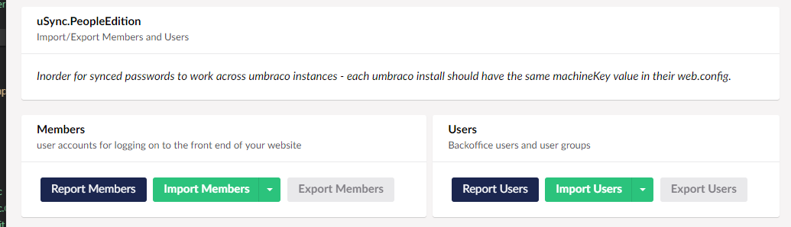

uSync.PeopleEdition adds four new handlers & serializers to uSync to manage users and member syncing between environments. 

These manage:

- Users
- User Groups
- Members
- Member Groups

:::caution
By default, PeopleEdition will not enable its handlers in the main uSync Import/Export process. This is to prevent accidental account overwriting.
:::

## Dashboard

People Edition also comes with a dashboard to export/import users and members. This does not rely on the config file so will work regardless of the config state of the handlers.

## Syncing passwords

Passwords are stored in Umbraco in a non-reversible hash. When uSync exports these for members and users they will be stored in the .config files for those accounts. 

When these values are imported to another Umbraco instance that instance has to use the same machine key values to hash passwords or they will not match when users attempt to login. 

As a result you should ensure that any Umbraco instances where you wish to sync members should have the same `machineKey` value in their `web.config` files.

:::tip
**uSync.PeopleEdition will not sync the main Umbraco Admin Account.** This is to stop you losing access to your Umbraco installation.
:::