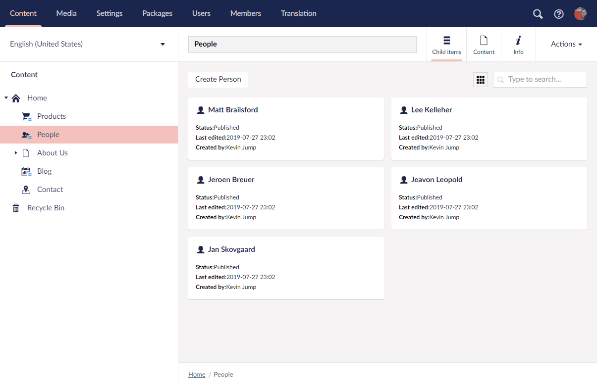

# Setting Up Publisher

uSync.Publisher lets you push and pull content, media and settings between Umbraco installations.

## Setup
To setup uSync.Publisher, there are a few steps you need to follow:

1. [Enable Publisher](enable)
2. [Share Api Keys](sharekeys)
3. [Add a Server](addserver)
4. [Push Content](pushcontent)

## More details
You can find out more details, and look at all the config options in the [uSync.Publisher section of this documentation.](../../../complete/introduction/index)
