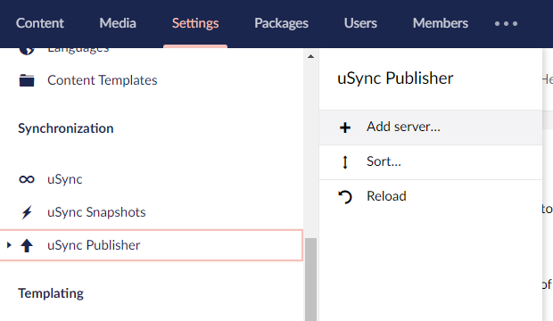
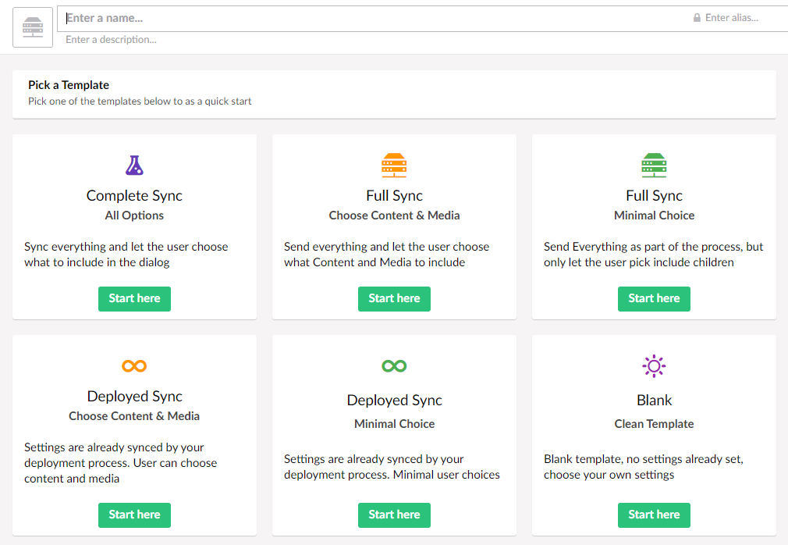
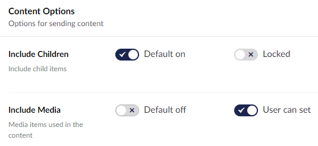
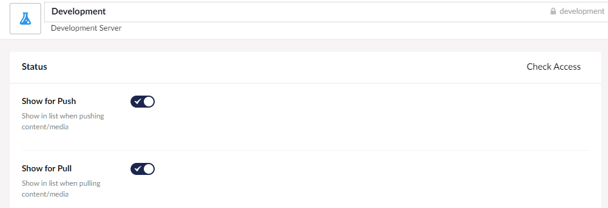

Before you can start to send or pull content between Umbraco installations you will need to add a server setup on the server you want to push from or pull to. 

### Add Server Menu
Before one site can push/pull settings to another, you will need to set up a server configuration on that server. To do this, go to the [uSync.Publisher](../../introduction/publisher) pages within the settings section of Umbraco and select "Add Server".

## Select a Template
You can then choose a template to use when adding a server, or choose blank. Which template you choose will depend on how you are setting up your servers and how much control you want to give your users. 

## Pick Settings 
There are several settings you can enable for a server. [The exact details of each one as described in the documentation](#). 

### Option Flags
For each option there are two toggles. These determine the default state of an option, as well as whether the user can turn the setting on or off at the point of publishing. 

Which options you let your users choose is up to you - the simpler the better!

> __Note:__ Include Ancestors and Include Linked can result in a large amount of content or media being synced. They are best left to their default values unless you know you will need to include everything each time you publish.

## Sync API Keys
Before you can send/receive any settings the server will need to be sharing keys. You should check you have [setup shared keys](sharekeys.md) between the servers.

## Check Access
Once you have set up the server, you can check whether access is correctly configured by clicking the 'Check Access' button

The Check Access button will give you the following responses: 

Response | Possible Cause
---------|---------------
Available | Everything is working.
Unauthorized | The AppID/AppKey used is incorrect.
Unreachable | The server cannot be contacted (could be off).
Disabled | The target server is not enabled (check its settings).
ServerError | There is something wrong with the target server.

