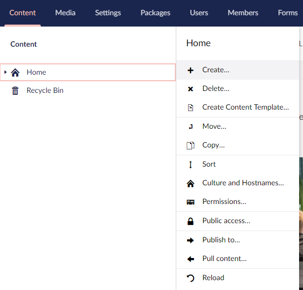
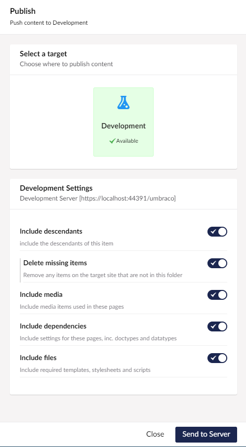
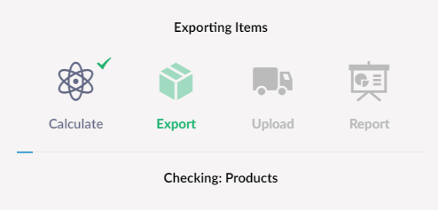
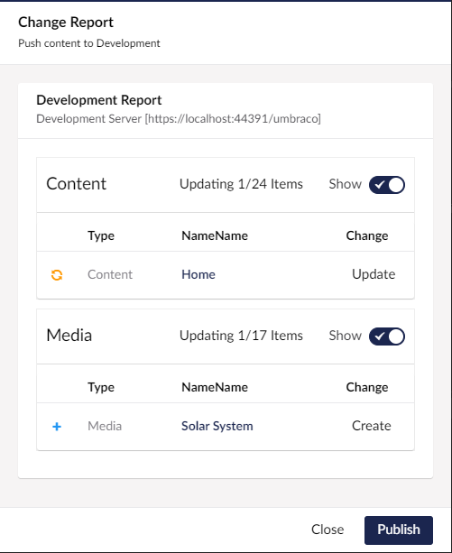
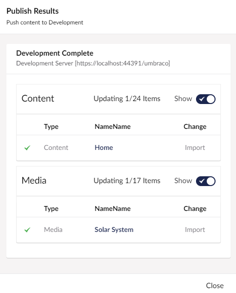

Once you have setup your server connections, you can push content between servers. 

### 1. Select Publish To
To push content, select the root node you wish to push from, right click and select Publish To... from the menu.

### 2. Select Server & Options

From the server selection, select the server you want to send to
and the options for sending content.

### 3. Send
When you select 'Send to Server' you will then see the progress screen while uSync.Publisher pushes the content out.

### 3. Review Report & Apply 

Once the changes have been sent, the server will return a change report which will detail any changes that have been made. 

You can then review these changes. If you are happy you can choose to apply the changes on the server. 

### 4. Complete
Once you have done this, you will again see the progress screen while the changes are applied, and you will get a final screen showing you the changes you have made. 

Once complete you will now be able to view the content on the target site. 